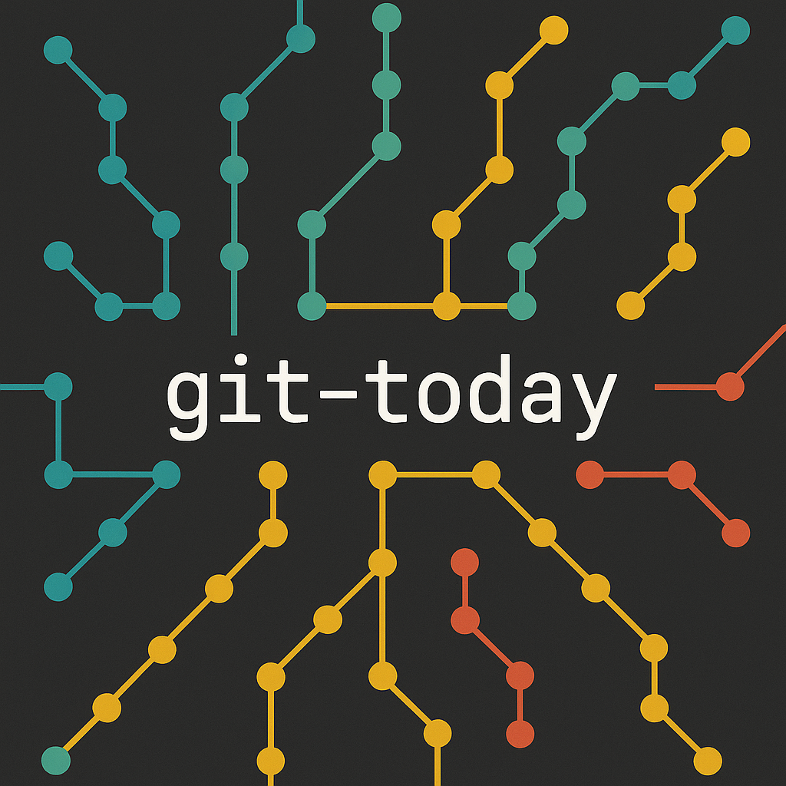

# `git-today`

[](https://github.com/bitSheriff/git-today/blob/main/LICENSE)
[](https://crates.io/crates/git-today)



A tool to recap your daily git work.

## Motivation

In my optinion, projects which solve a problem firstly to use, are the most valueable. So the idea for this project was born while I was writing my bachelor thesis:
working all day in a project which gets bigger and bigger, the commits are piling up (big fan of commiting small chunks when working with LaTeX) and at the end of the day I had no idea how *much* I worked and how. Pretty early in the process I commited to "mark" my commits with little tags inside the message (not like `git tag`) to get a quick overview what this commit is about.

So I said to myself, why not analyze the commit history of today and print nice little statistics.

## Installation

[](https://repology.org/project/git-today/versions)

Currently no binaries are provided yet, so you can install it with `cargo` directly

```sh
# Use the version on Crates.io
cargo install git-today

# Use the GitHub version
cargo install --git https://github.com/bitSheriff/git-today

# Use my selfhosted version
cargo install --git https://code.bitsheriff.dev/bitSheriff/git-today
```

or with the AUR

```sh
yay -S git-today
```

## Usage

```
A tool to recap your daily git work

Usage: git-today [OPTIONS] [path]

Arguments:
  [path]  Path to the git repository [default: .]

Options:
  -v, --version  Print version information
      --full     Print commit messages
  -h, --help     Print help
```

And this will print a small table which looks like:
```
╭────────────┬──────────────╮
│ Author     ┆ # of Commits │
╞════════════╪══════════════╡
│ bitSheriff ┆      11      │
╰────────────┴──────────────╯
╭─────────────┬──────────────╮
│ Issue Type  ┆ # of Commits │
╞═════════════╪══════════════╡
│ 🐛 Bugs     ┆       1      │
├╌╌╌╌╌╌╌╌╌╌╌╌╌┼╌╌╌╌╌╌╌╌╌╌╌╌╌╌┤
│ 🚀 Features ┆       4      │
├╌╌╌╌╌╌╌╌╌╌╌╌╌┼╌╌╌╌╌╌╌╌╌╌╌╌╌╌┤
│ 📝 Docs     ┆       4      │
╰─────────────┴──────────────╯
```

The `--full` option prints commit messages and changed file as well as all available issue types

```sh
╭─────────┬──────────────┬──────┬──────┬───────╮
│ Author  ┆ # of Commits ┆ Adds ┆ Dels ┆ Files │
╞═════════╪══════════════╪══════╪══════╪═══════╡
│ Author4 ┆       4      ┆   4  ┆   4  ┆   1   │
├╌╌╌╌╌╌╌╌╌┼╌╌╌╌╌╌╌╌╌╌╌╌╌╌┼╌╌╌╌╌╌┼╌╌╌╌╌╌┼╌╌╌╌╌╌╌┤
│ Author1 ┆       1      ┆   1  ┆   0  ┆   1   │
├╌╌╌╌╌╌╌╌╌┼╌╌╌╌╌╌╌╌╌╌╌╌╌╌┼╌╌╌╌╌╌┼╌╌╌╌╌╌┼╌╌╌╌╌╌╌┤
│ Author2 ┆       1      ┆   1  ┆   1  ┆   1   │
├╌╌╌╌╌╌╌╌╌┼╌╌╌╌╌╌╌╌╌╌╌╌╌╌┼╌╌╌╌╌╌┼╌╌╌╌╌╌┼╌╌╌╌╌╌╌┤
│ Author3 ┆       1      ┆   1  ┆   1  ┆   1   │
╰─────────┴──────────────┴──────┴──────┴───────╯
╭───────────────┬──────────────╮
│ Issue Type    ┆ # of Commits │
╞═══════════════╪══════════════╡
│ 🐛 Bugs       ┆       1      │
├╌╌╌╌╌╌╌╌╌╌╌╌╌╌╌┼╌╌╌╌╌╌╌╌╌╌╌╌╌╌┤
│ 🚀 Features   ┆       5      │
├╌╌╌╌╌╌╌╌╌╌╌╌╌╌╌┼╌╌╌╌╌╌╌╌╌╌╌╌╌╌┤
│ ♻️ Refactrors ┆       0      │
├╌╌╌╌╌╌╌╌╌╌╌╌╌╌╌┼╌╌╌╌╌╌╌╌╌╌╌╌╌╌┤
│ 📝 Docs       ┆       1      │
├╌╌╌╌╌╌╌╌╌╌╌╌╌╌╌┼╌╌╌╌╌╌╌╌╌╌╌╌╌╌┤
│ 🧬 Merges     ┆       0      │
├╌╌╌╌╌╌╌╌╌╌╌╌╌╌╌┼╌╌╌╌╌╌╌╌╌╌╌╌╌╌┤
│ 🔍 Tests      ┆       0      │
╰───────────────┴──────────────╯

Changed files today:
- dummy.txt

Commit messages today:
- feat: new author
- feat: new author
- feat: new author
- feat: new author
- doc: documented something
- bug: fixed something
- feat: init repo
```


To use this tool with `git today`, you can create a git alias.

### Set the alias in the current repository:

```sh
git config alias.today "!git-today"
```

### Set the alias globally for your user:

```sh
git config --global alias.today "!git-today"
```
